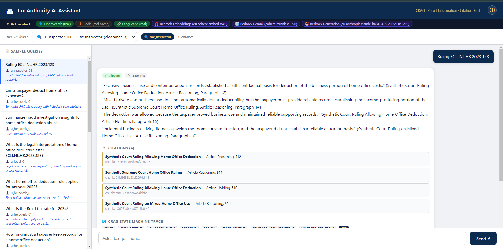
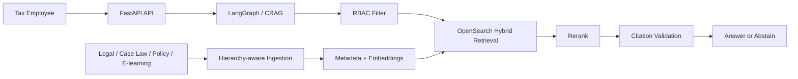

# Tax Authority RAG

<p align="center">
  <strong>Enterprise RAG architecture for a secure internal AI assistant for the National Tax Authority.</strong>
</p>

<p align="center">
  
  
  
  
</p>

This repository presents a **working assessment implementation and architecture package** for a secure Enterprise RAG assistant serving a National Tax Authority use case. It focuses on **citation-grounded answers, RBAC-before-retrieval, hybrid retrieval quality, and production-oriented evaluation discipline** across legislation, case law, internal policy, and training content.

It is designed to show both:

- **engineering judgment** — clear architectural tradeoffs, bounded complexity, and security-first design
- **execution ability** — implemented code, tests, evaluation assets, live Bedrock validation, and reproducible documentation

## Recommended reviewer reading order

1. [`docs/reports/FINAL_ASSIGNMENT_REPORT.md`](docs/reports/FINAL_ASSIGNMENT_REPORT.md)
2. [`docs/FINAL_TECHNICAL_ASSESSMENT_ANSWER.md`](docs/FINAL_TECHNICAL_ASSESSMENT_ANSWER.md)
3. [`docs/reports/ASSIGNMENT_ALIGNMENT_REPORT.md`](docs/reports/ASSIGNMENT_ALIGNMENT_REPORT.md)
4. Stage reports in `docs/reports/`

## Example of live testing

The image below is an example of the working local test/demo interface used for validating the Bedrock-backed stack:



## What an engineering reviewer should notice quickly

- The system is **not a generic chatbot wrapper**; it is a constrained legal/fiscal RAG design with explicit safety guarantees.
- The repository contains both **deterministic local validation** and a **real Bedrock-backed runtime path**.
- The documentation separates **what is already proven** from **what remains a production next step**, which is usually a sign of strong engineering maturity.
- The final submission is organized so a reviewer can move from **executive summary -> architecture -> evidence -> detailed reports** without getting lost.

## Why this design stands out

- **Citation-first generation** — every accepted claim must cite **document name, article, and paragraph**.
- **RBAC before retrieval** — unauthorized FIOD/fraud documents are excluded **before** BM25, vector search, fusion, reranking, prompting, and cache access.
- **High-precision retrieval** — **OpenSearch + HNSW + BM25 + vector search + RRF + reranking** tuned for legal/fiscal queries.
- **Self-healing RAG** — a **LangGraph-style CRAG loop** grades evidence as `Relevant`, `Ambiguous`, or `Irrelevant`, then rewrites, decomposes, retries, or abstains.

## Architecture snapshot



## Concrete design choices

| Module | Key decisions |
| --- | --- |
| **Ingestion** | Legal-aware chunking preserves `chapter → section → article → paragraph`; case law preserves `ECLI`, facts, reasoning, holding, and numbered paragraphs. |
| **Vector DB** | **OpenSearch** with HNSW `m=32`, `ef_construction=256`, `ef_search=128`; shard sizing + bounded top-k + quantization guidance for 20M+ chunks. |
| **Retrieval** | Hybrid **BM25 + dense vector** retrieval with **RRF**; defaults: lexical `50`, vector `50`, fused `80`, rerank `60`, final context `5-8`. |
| **Generation** | Deterministic **CRAG** with bounded retries: retrieval attempts `2`, rewrites `1`, HyDE `1`, decomposition max `4`, then abstain if evidence is unsafe. |
| **Ops & Security** | Semantic cache is authorization-scoped with safe threshold `0.95` (never below `0.92` without formal eval); RBAC leakage tolerance is `0`. |

## Validation highlights

- **Assignment coverage:** `92–95%`
- **Offline suite:** `97 passed, 9 skipped`
- **Live Bedrock compatibility:** `3 passed`
- **Live retrieval/rerank checks:** `2 passed`
- **Targeted production gate:** `TTFT p95 < 1.5s`

## Assessment positioning

This repository should be read as an **implementation-ready assessment submission**, not only as a slide-deck architecture answer.

What is already demonstrated:

- working FastAPI application and RAG modules
- legal-aware ingestion and metadata preservation
- hybrid OpenSearch-style retrieval design
- RBAC-before-retrieval enforcement
- CRAG-style bounded orchestration
- citation validation and abstention behavior
- formal tests across unit, integration, security, evaluation, and performance smoke scenarios
- real Bedrock/OpenSearch/Redis/LangGraph validation path

What is intentionally not overstated:

- this is **not yet a full production deployment over a 500,000-document / 20M+ chunk corpus**
- some production-scale benchmarking, managed infrastructure rollout, and full judge-based evaluation remain next steps

That balance is important in senior engineering review: the project aims to be **credible, concrete, and honest**.

## Quick start

```bash
python -m pip install -r requirements.txt
python -m pytest -q
python -m uvicorn app.main:app --host 127.0.0.1 --port 8000
```

Then open **`http://127.0.0.1:8000/docs`**.

Optional local stack:

```bash
docker compose -f docker-compose.test.yml up --build
```

## Best entry points

- **Final consolidated report:** [`docs/reports/FINAL_ASSIGNMENT_REPORT.md`](docs/reports/FINAL_ASSIGNMENT_REPORT.md)
- **Final answer:** [`docs/FINAL_TECHNICAL_ASSESSMENT_ANSWER.md`](docs/FINAL_TECHNICAL_ASSESSMENT_ANSWER.md)
- **Architecture plan:** [`docs/ARCHITECTURE_PLAN.md`](docs/ARCHITECTURE_PLAN.md)
- **Assignment fit:** [`docs/reports/ASSIGNMENT_ALIGNMENT_REPORT.md`](docs/reports/ASSIGNMENT_ALIGNMENT_REPORT.md)
- **Evaluation & metrics:** [`docs/reports/STAGE_4_DEEPEVAL_AND_RETRIEVAL_QUALITY_REPORT.md`](docs/reports/STAGE_4_DEEPEVAL_AND_RETRIEVAL_QUALITY_REPORT.md)
- **Local PoC report:** [`docs/reports/STAGE_1_IMPLEMENTATION_REPORT.md`](docs/reports/STAGE_1_IMPLEMENTATION_REPORT.md)

## Live System Evidence

The project includes a validated real Bedrock stack running locally via Docker with:

- **OpenSearch** (real hybrid BM25 + vector retrieval)
- **Redis** (real semantic cache)
- **LangGraph** (real CRAG state machine)
- **Bedrock Cohere Embed v4** (`eu.cohere.embed-v4:0`)
- **Bedrock Cohere Rerank 3.5** (`cohere.rerank-v3-5:0`)
- **Bedrock Claude Haiku 4.5** (`eu.anthropic.claude-haiku-4-5-20251001-v1:0`)

The system demonstrates:

- ✅ **Citation-complete answers** with document name, article, and paragraph
- ✅ **RBAC enforcement** before retrieval (helpdesk cannot access FIOD content)
- ✅ **CRAG state machine** with bounded retries and safe abstention
- ✅ **Real-time validation** against expected behaviors
- ✅ **Authorization-scoped semantic cache** with `0.95` similarity threshold

### Running the Real Bedrock Stack

```bash
# Requires AWS credentials with Bedrock access in eu-central-1
docker compose -f docker-compose.test.yml --profile bedrock up --build api-bedrock -d
```

Then open **`http://localhost:8002/`** to interact with the live system.


## Repository map

```text
app/               FastAPI app + RAG modules
docs/              Final architecture answer, module docs, reports
sample_corpus/     Synthetic legal / policy / case-law corpus
sample_requests/   Users, queries, expected behaviors
tests/             Unit, integration, security, eval, and perf checks
infra/             Optional deployment direction
```

> Note: the bundled corpus is synthetic and for architecture, testing, and evaluation only — **not real tax advice**.