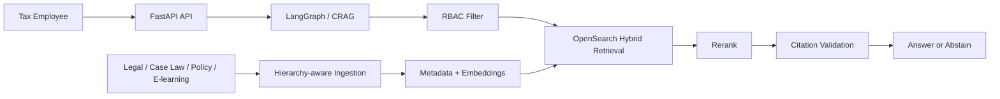

# Tax Authority RAG

<p align="center">
  <strong>Enterprise RAG architecture for a secure internal AI assistant for the National Tax Authority.</strong>
</p>

<p align="center">
  
  
  
  
</p>

This repository is a polished interview assignment for designing a **zero-hallucination, citation-grounded, role-secure Enterprise RAG system** over legislation, case law, internal policy, and training content at Tax Authority scale.

## Why this design stands out

- **Citation-first generation** — every accepted claim must cite **document name, article, and paragraph**.
- **RBAC before retrieval** — unauthorized FIOD/fraud documents are excluded **before** BM25, vector search, fusion, reranking, prompting, and cache access.
- **High-precision retrieval** — **OpenSearch + HNSW + BM25 + vector search + RRF + reranking** tuned for legal/fiscal queries.
- **Self-healing RAG** — a **LangGraph-style CRAG loop** grades evidence as `Relevant`, `Ambiguous`, or `Irrelevant`, then rewrites, decomposes, retries, or abstains.

## Architecture snapshot



## Concrete design choices

| Module | Key decisions |
| --- | --- |
| **Ingestion** | Legal-aware chunking preserves `chapter → section → article → paragraph`; case law preserves `ECLI`, facts, reasoning, holding, and numbered paragraphs. |
| **Vector DB** | **OpenSearch** with HNSW `m=32`, `ef_construction=256`, `ef_search=128`; shard sizing + bounded top-k + quantization guidance for 20M+ chunks. |
| **Retrieval** | Hybrid **BM25 + dense vector** retrieval with **RRF**; defaults: lexical `50`, vector `50`, fused `80`, rerank `60`, final context `5-8`. |
| **Generation** | Deterministic **CRAG** with bounded retries: retrieval attempts `2`, rewrites `1`, HyDE `1`, decomposition max `4`, then abstain if evidence is unsafe. |
| **Ops & Security** | Semantic cache is authorization-scoped with safe threshold `0.95` (never below `0.92` without formal eval); RBAC leakage tolerance is `0`. |

## Validation highlights

- **Assignment coverage:** `92–95%`
- **Offline suite:** `97 passed, 9 skipped`
- **Live Bedrock compatibility:** `3 passed`
- **Live retrieval/rerank checks:** `2 passed`
- **Targeted production gate:** `TTFT p95 < 1.5s`

## Quick start

```bash
python -m pip install -r requirements.txt
python -m pytest -q
python -m uvicorn app.main:app --host 127.0.0.1 --port 8000
```

Then open **`http://127.0.0.1:8000/docs`**.

Optional local stack:

```bash
docker compose -f docker-compose.test.yml up --build
```

## Best entry points

- **Final answer:** [`docs/FINAL_TECHNICAL_ASSESSMENT_ANSWER.md`](docs/FINAL_TECHNICAL_ASSESSMENT_ANSWER.md)
- **Architecture plan:** [`docs/ARCHITECTURE_PLAN.md`](docs/ARCHITECTURE_PLAN.md)
- **Assignment fit:** [`docs/ASSIGNMENT_ALIGNMENT_REPORT.md`](docs/ASSIGNMENT_ALIGNMENT_REPORT.md)
- **Evaluation & metrics:** [`docs/STAGE_4_DEEPEVAL_AND_RETRIEVAL_QUALITY_REPORT.md`](docs/STAGE_4_DEEPEVAL_AND_RETRIEVAL_QUALITY_REPORT.md)
- **Local PoC report:** [`docs/STAGE_1_IMPLEMENTATION_REPORT.md`](docs/STAGE_1_IMPLEMENTATION_REPORT.md)

## Repository map

```text
app/               FastAPI app + RAG modules
docs/              Final architecture answer, module docs, reports
sample_corpus/     Synthetic legal / policy / case-law corpus
sample_requests/   Users, queries, expected behaviors
tests/             Unit, integration, security, eval, and perf checks
infra/             Optional deployment direction
```

> Note: the bundled corpus is synthetic and for architecture, testing, and evaluation only — **not real tax advice**.