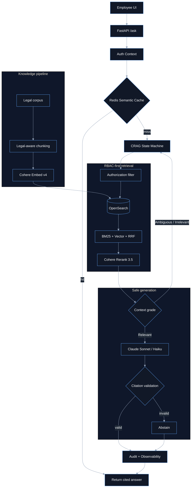
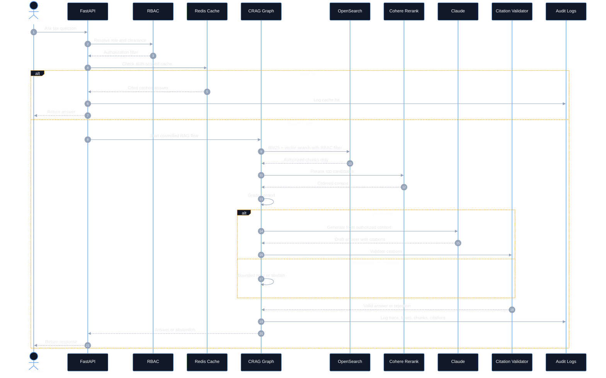

# Technical Assessment Answer: Enterprise RAG Architecture for the Tax Authority

## Executive Summary

I would build the Tax Authority assistant as a secure, citation-first Enterprise
RAG platform with four hard guarantees:

1. **Legal hierarchy is preserved before embedding.** Legislation is chunked by
   chapter/section/article/paragraph; case law is chunked by ECLI, facts, legal
   question, reasoning, holding, and numbered paragraphs.
2. **RBAC is enforced before retrieval scoring.** Unauthorized FIOD/fraud chunks
   are excluded before BM25, vector KNN, fusion, reranking, prompt construction,
   generation, and cache lookup/write.
3. **Generation is corrective and bounded.** A LangGraph-style CRAG state
   machine grades evidence as `Relevant`, `Ambiguous`, or `Irrelevant`; it
   rewrites/decomposes/retries only within strict limits and abstains rather than
   hallucinating.
4. **Every answer is citation-validated.** A generated answer is accepted only
   if each claim cites an authorized retrieved chunk with document name,
   document ID, article/section, and paragraph.

Primary technology choices:

| Layer | Choice | Reason |
| --- | --- | --- |
| API | FastAPI | Simple internal HTTP interface and low operational complexity. |
| Orchestration | LangGraph-style deterministic CRAG | Auditable state transitions and bounded fallback behavior. |
| Vector/search DB | OpenSearch | Hybrid BM25 + vector search, HNSW, filters, operational maturity, AWS fit. |
| Embeddings | Cohere Embed v4 via Bedrock | Strong multilingual/legal semantic embeddings; validated runtime profile `eu.cohere.embed-v4:0`. |
| Reranking | Cohere Rerank 3.5 via Bedrock | High-precision candidate ordering; validated model ID `cohere.rerank-v3-5:0`. |
| Runtime LLM | Claude Sonnet for high-risk, Haiku only for low-risk helper tasks | Safety-first routing; Sonnet for fiscal/legal advice. |
| Cache | Redis semantic cache | Low-latency FAQ reuse with strict role/citation scoping. |
| Evaluation | DeepEval plus deterministic security gates | Formal faithfulness/citation/RBAC gates before release. |
| Observability | Structured audit logs + OpenTelemetry/CloudWatch | Trace RBAC, retrieved chunks, citations, abstentions, latency, and failures. |

---

## Module 1: Ingestion & Knowledge Structuring

### Chunking Strategy for Legal Codes

Generic recursive splitters are not acceptable for legislation because they
destroy the hierarchy needed for exact citations. I would parse legal documents
by legal structure first and split only inside an already identified legal unit
when a unit is too long.

For legislation/regulations:

- Parse `Chapter → Section → Article → Paragraph`.
- Use **one paragraph per chunk** where possible.
- Attach metadata before embedding:
  - `document_id`
  - `document_name`
  - `source_type`
  - `chapter`
  - `section_path`
  - `article`
  - `paragraph`
  - `effective_from`
  - `effective_to`
  - `version`
  - `classification_level`
  - `allowed_roles`
  - `classification_tags`
  - stable `chunk_id`

For case law/jurisprudence:

- Preserve `ECLI`, court, date, parties, facts, legal question, reasoning,
  holding, and paragraph numbers.
- Chunk dense reasoning by numbered paragraphs or coherent reasoning blocks.
- Store `ecli` as both keyword and searchable text.

For internal policies and e-learning:

- Preserve heading hierarchy, paragraph/section numbers, document owner,
  classification, allowed roles, and policy version.

### Chunking Pseudo-Code

```python
def ingest_document(path):
    raw = load_document(path)
    header = parse_front_matter(raw)

    if header.source_type == "legislation":
        units = parse_chapter_section_article_paragraph(raw)
    elif header.source_type == "case_law":
        units = parse_ecli_facts_question_reasoning_holding(raw)
    else:
        units = parse_policy_or_training_sections(raw)

    chunks = []
    for unit in units:
        for paragraph in split_inside_legal_unit_only(unit, max_tokens=900):
            chunk = {
                "chunk_id": stable_hash(header.document_id, unit.path, paragraph.number),
                "document_id": header.document_id,
                "document_name": header.document_name,
                "source_type": header.source_type,
                "text": paragraph.text,
                "article": unit.article_or_section,
                "paragraph": paragraph.number,
                "section_path": unit.section_path,
                "effective_from": header.effective_from,
                "effective_to": header.effective_to,
                "version": header.version,
                "classification_level": header.classification_level,
                "allowed_roles": header.allowed_roles,
                "classification_tags": header.classification_tags,
                "ecli": header.ecli,
            }
            assert chunk["document_name"] and chunk["article"] and chunk["paragraph"]
            chunks.append(chunk)

    embeddings = cohere_embed_v4([embedding_text(c) for c in chunks])
    bulk_index_opensearch(chunks, embeddings)
```

### Vector Database and Scale

I select **OpenSearch** as the primary retrieval store because it supports:

- BM25 and exact keyword search.
- HNSW vector search.
- Query-time and document-level filters.
- Operational fit for AWS environments.
- Hybrid retrieval in one system.

For `500,000` documents and potentially `20M+` chunks, I would start with this
OpenSearch index configuration:

```json
{
  "settings": {
    "index.knn": true,
    "index.knn.algo_param.ef_search": 128,
    "number_of_shards": 12,
    "number_of_replicas": 1,
    "refresh_interval": "30s"
  },
  "mappings": {
    "properties": {
      "chunk_id": {"type": "keyword"},
      "document_id": {"type": "keyword"},
      "document_name": {"type": "text", "fields": {"keyword": {"type": "keyword"}}},
      "source_type": {"type": "keyword"},
      "text": {"type": "text"},
      "article": {"type": "keyword"},
      "paragraph": {"type": "keyword"},
      "section_path": {"type": "keyword"},
      "effective_from": {"type": "date", "ignore_malformed": true},
      "effective_to": {"type": "date", "ignore_malformed": true},
      "version": {"type": "keyword"},
      "classification_level": {"type": "integer"},
      "allowed_roles": {"type": "keyword"},
      "classification_tags": {"type": "keyword"},
      "case_scope": {"type": "keyword"},
      "ecli": {"type": "keyword", "fields": {"text": {"type": "text"}}},
      "embedding": {
        "type": "knn_vector",
        "dimension": 1024,
        "method": {
          "name": "hnsw",
          "engine": "faiss",
          "space_type": "innerproduct",
          "parameters": {
            "m": 32,
            "ef_construction": 256
          }
        }
      }
    }
  }
}
```

Memory/OOM controls:

- Start with `m=32`, `ef_construction=256`, runtime `ef_search=128`.
- Benchmark shard count so each shard keeps vector graph memory bounded.
- Use bulk indexing and set `refresh_interval=30s` during ingestion.
- Use `1s` or default refresh after ingestion.
- Use vector quantization/byte vectors only after recall benchmarking.
- Keep top-k bounded: lexical `50`, vector `50`, fused `80`, rerank `60`, final
  `8`.
- Monitor JVM heap, native memory, circuit breakers, p95/p99 latency, and OOM
  events.

---

## Module 2: Retrieval Strategy (High Precision)

### Hybrid Search Design

Tax questions contain both exact identifiers and semantic concepts. I would use
parallel sparse and dense retrieval:

- **Sparse BM25/keyword** for `ECLI:NL:HR:2023:123`, article numbers, document
  IDs, fiscal terms, and exact legal references.
- **Dense vector search** for semantic concepts like “deductibility of home
  office expenses”.
- **RBAC filter before both searches**.
- **RRF fusion** instead of raw score weighting because BM25 and vector scores
  are not directly comparable.

Recommended defaults:

| Parameter | Value |
| --- | --- |
| BM25 top-k | `50` |
| Vector top-k | `50` |
| RRF rank constant | `60` |
| Fused candidates | `80` |
| Rerank candidates | `60` |
| Final context chunks | `5-8` |
| HNSW `ef_search` | `128` |
| ECLI boost | `ecli^12`, `ecli.text^12` |
| Document ID boost | `document_id^8` |
| Article boost | `article^5` |
| Text boost | `text^2` |

### Retrieval Query Pseudo-Code

```python
def retrieve(query, user):
    auth_filter = {
        "bool": {
            "filter": [
                {"term": {"allowed_roles": user.role}},
                {"range": {"classification_level": {"lte": user.clearance}}}
            ],
            "must_not": denied_tags_for(user)
        }
    }

    bm25 = opensearch.search(
        index="tax-rag-chunks-v1",
        size=50,
        query={
            "bool": {
                "filter": auth_filter["bool"]["filter"],
                "must_not": auth_filter["bool"]["must_not"],
                "must": [{
                    "multi_match": {
                        "query": query,
                        "fields": ["ecli^12", "ecli.text^12", "document_id^8", "article^5", "text^2"],
                        "type": "best_fields"
                    }
                }]
            }
        }
    )

    vector = opensearch.search(
        index="tax-rag-chunks-v1",
        size=50,
        query={
            "bool": {
                "filter": auth_filter["bool"]["filter"],
                "must_not": auth_filter["bool"]["must_not"],
                "must": [{
                    "knn": {
                        "embedding": {
                            "vector": cohere_embed_v4(query, input_type="search_query"),
                            "k": 50,
                            "method_parameters": {"ef_search": 128}
                        }
                    }
                }]
            }
        }
    )

    fused = reciprocal_rank_fusion([bm25, vector], k=60)
    candidates = fused[:80]
    reranked = cohere_rerank_3_5(query, candidates[:60])
    final_context = take_citation_complete(reranked, limit=8)

    assert all(is_authorized(c, user) for c in final_context)
    return final_context
```

### Reranking Strategy

I would use **Cohere Rerank 3.5** via Bedrock for the production path. In this
project, live validation confirmed `cohere.rerank-v3-5:0` works with this
payload shape:

```json
{
  "api_version": 2,
  "query": "home office deduction",
  "documents": ["candidate text 1", "candidate text 2"]
}
```

The reranker is capped at `60` candidates and final context is capped at `8`
chunks to protect TTFT and cost.

---

## Module 3: Agentic RAG & Self-Healing (Generation)

### Query Transformation

Complex fiscal questions are transformed before retrieval:

- **Query decomposition** for multi-part questions, multiple tax years, multiple
  legal issues, or comparisons.
- **HyDE** only as a bounded semantic retrieval expansion, never as evidence.
- **Query rewrite** only when retrieval is irrelevant, capped at one rewrite.

Examples:

- “Compare the 2022 and 2024 home office deduction rules” → two subqueries by
  tax year and article/version.
- “What is the legal interpretation after ECLI:NL:HR:2023:123?” → exact ECLI
  lexical retrieval plus semantic legal-interpretation retrieval.

### CRAG State Machine

I would implement this as a LangGraph state machine, not a free-form agent:

```text
START
  -> AUTH_CONTEXT
  -> CLASSIFY_QUERY
  -> DECOMPOSE_QUERY?              # if multi-part
  -> RETRIEVE                      # RBAC-filtered hybrid retrieval
  -> RERANK                        # Cohere/cross-encoder, authorized only
  -> GRADE_CONTEXT                 # Relevant / Ambiguous / Irrelevant
  -> GENERATE_WITH_CITATIONS       # only if Relevant
  -> VALIDATE_CITATIONS
  -> END

GRADE_CONTEXT -> REWRITE_QUERY -> RETRIEVE       # Irrelevant and retry available
GRADE_CONTEXT -> HYDE_QUERY -> RETRIEVE          # bounded semantic expansion
GRADE_CONTEXT -> DECOMPOSE_QUERY -> RETRIEVE     # Ambiguous/multi-part
GRADE_CONTEXT -> ABSTAIN                         # unsafe or retry exhausted
VALIDATE_CITATIONS -> ABSTAIN                    # unsupported citation
```

Configuration:

| Parameter | Value |
| --- | --- |
| Max retrieval attempts | `2` |
| Max query rewrites | `1` |
| Max HyDE attempts | `1` |
| Max decomposition subqueries | `4` |
| Relevant confidence | `>= 0.75` |
| Ambiguous confidence | `0.45-0.75` or conflict/missing date/multi-part |
| Irrelevant confidence | `< 0.45` or no authorized context |

### Retrieval Evaluator / Grader

The retrieval grader returns strict JSON:

```json
{
  "label": "Relevant | Ambiguous | Irrelevant",
  "confidence": 0.91,
  "reasons": ["query tokens covered by Article 3.12 paragraph 2"],
  "missing_evidence": [],
  "required_action": "generate_with_citations"
}
```

Fallback actions:

| Label | Action |
| --- | --- |
| `Relevant` | Generate with citations, then validate citations. |
| `Ambiguous` | Decompose by issue/tax year or use bounded HyDE; if still ambiguous, abstain/request clarification. |
| `Irrelevant` | Rewrite once or HyDE once; if still irrelevant, abstain. |

Generation prompt contract:

```text
Use only the authorized context. Every claim must include document name,
document ID, article/section, and paragraph. If the answer is not fully
supported by the context, abstain. Do not use model memory.
```

Citation validator:

```python
def validate(answer, retrieved_context):
    authorized_ids = {c.chunk_id for c in retrieved_context}
    if not answer.citations:
        return "ABSTAIN"
    for citation in answer.citations:
        if citation.chunk_id not in authorized_ids:
            return "ABSTAIN"
        if not citation.document_name or not citation.article or not citation.paragraph:
            return "ABSTAIN"
    return "END"
```

---

## Module 4: Production Ops, Security & Evaluation

### Semantic Caching

I would use Redis for conservative semantic caching, primarily for FAQ-like
answers. Financial/tax data cannot tolerate loose cache reuse.

Cache rules:

- Safe threshold: cosine similarity `0.95`.
- Absolute minimum candidate threshold: `0.92`, only after evaluation.
- Cache only citation-complete, authorization-safe answers.
- Never cache abstentions or prompt-injection attempts.
- Cache key includes:
  - normalized query hash
  - user role
  - clearance
  - need-to-know scope
  - corpus version
  - embedding model version
  - RBAC policy version
  - citation IDs hash

```python
cache_key = hash({
    "query": normalize(query),
    "role": user.role,
    "clearance": user.clearance,
    "need_to_know": user.need_to_know_groups,
    "corpus_version": corpus.version,
    "embedding_model": embedding_model.version,
    "rbac_policy_version": rbac.version,
    "citation_ids": sorted(citation_ids),
})
```

### Database-Level Security / RBAC

RBAC must occur **before retrieval scoring**. Post-filtering is not sufficient
because unauthorized documents could influence vector neighborhoods, scores,
fusion ranks, reranker order, prompts, or cache entries.

Helpdesk example:

```json
{
  "bool": {
    "filter": [
      {"term": {"allowed_roles": "helpdesk"}},
      {"range": {"classification_level": {"lte": 2}}}
    ],
    "must_not": [
      {"term": {"classification_tags": "FIOD"}},
      {"term": {"classification_tags": "fraud_investigation"}}
    ]
  }
}
```

Pipeline rule:

```text
Auth filter → BM25/KNN retrieval → fusion → rerank → prompt → generation → cache write
```

Unauthorized chunks never enter the candidate set. The LLM is not an
authorization layer and never sees restricted context.

### CI/CD Evaluation

I would use DeepEval as the formal framework and track Ragas-style metric names
only as vocabulary. Gates run at PR, main, and release levels.

Required metrics:

| Metric | Target |
| --- | --- |
| Faithfulness | `>= 0.98` release gate |
| Context Precision | `>= 0.92` release gate |
| Context Recall | `>= 0.90` release gate |
| Answer Relevance | `>= 0.90` main/release gate |
| Citation Completeness | `1.0` |
| Citation Accuracy | `1.0` |
| RBAC Leakage Count | `0` |
| Unauthorized Citation Count | `0` |
| Prompt Injection Success Count | `0` |
| Abstention Correctness | `>= 0.98` |
| TTFT p95 | `< 1.5s` |
| Latency p99 | `< 8s` |
| OOM Events | `0` |

Evaluation pseudo-code:

```python
def release_gate(candidate_system):
    results = deepeval.evaluate(
        test_cases=zero_hallucination + rbac + routing + perf_smoke,
        metrics=[
            FaithfulnessMetric(threshold=0.98),
            ContextualPrecisionMetric(threshold=0.92),
            AnswerRelevancyMetric(threshold=0.90),
            CitationCompletenessMetric(threshold=1.0),
            RbacLeakageMetric(max_count=0),
            AbstentionCorrectnessMetric(threshold=0.98),
        ],
    )
    assert results.passed
```

### Observability

Every request emits structured audit logs:

- user ID, role, clearance, need-to-know scope
- query hash
- RBAC filter hash
- retrieved chunk IDs
- reranked chunk IDs
- citation IDs
- grader label and reasons
- abstention reason
- cache hit/miss
- TTFT, retrieval latency, rerank latency, generation latency
- model IDs and embedding version
- OpenSearch circuit breaker/OOM signals

Alerts:

- citation completeness drops below `100%`
- RBAC leakage count above `0`
- TTFT p95 above `1.5s`
- OpenSearch circuit breaker trips
- OOM event detected
- abstention rate spike
- prompt-injection success count above `0`

---

## Model Routing Recommendation

For the Tax Authority, I would not use a cheap model for all answers. Routing is
based on risk:

| Route | Use For | Model |
| --- | --- | --- |
| Deterministic/local | CI, offline tests, exact extractive baseline | deterministic composer |
| Haiku-class | Low-risk helper tasks only: classification, formatting, simple FAQ if thresholds pass | Claude Haiku 4.5 EU profile |
| Sonnet-class | Legal interpretation, case law, FIOD/fraud, numeric fiscal advice, version conflicts, final answers | Claude Sonnet / Sonnet 3.7 EU profile |

Haiku is allowed only if DeepEval confirms faithfulness within `0.02` of Sonnet
and citation/RBAC/abstention thresholds pass. Otherwise route to Sonnet.

---

## Final Implementation Readiness

This design is concrete enough for immediate engineering work:

- The ingestion metadata schema is explicit.
- OpenSearch index settings and HNSW parameters are specified.
- Hybrid retrieval queries, RRF, and rerank top-k values are specified.
- RBAC is mathematically placed before retrieval scoring.
- CRAG states and fallback actions are specified.
- Semantic cache keys and thresholds are specified.
- CI/CD metrics and release gates are specified.
- Observability and audit fields are specified.

The validated local implementation and reports supporting this answer are:

- [`docs/reports/STAGE_1_IMPLEMENTATION_REPORT.md`](reports/STAGE_1_IMPLEMENTATION_REPORT.md)
- [`docs/reports/STAGE_2_BEDROCK_COMPATIBILITY_REPORT.md`](reports/STAGE_2_BEDROCK_COMPATIBILITY_REPORT.md)
- [`docs/reports/STAGE_3_BEDROCK_RAG_EVALUATION_REPORT.md`](reports/STAGE_3_BEDROCK_RAG_EVALUATION_REPORT.md)
- [`docs/reports/STAGE_4_DEEPEVAL_AND_RETRIEVAL_QUALITY_REPORT.md`](reports/STAGE_4_DEEPEVAL_AND_RETRIEVAL_QUALITY_REPORT.md)


---

## Appendix: Architecture Diagrams

### System Architecture



### Request Flow


